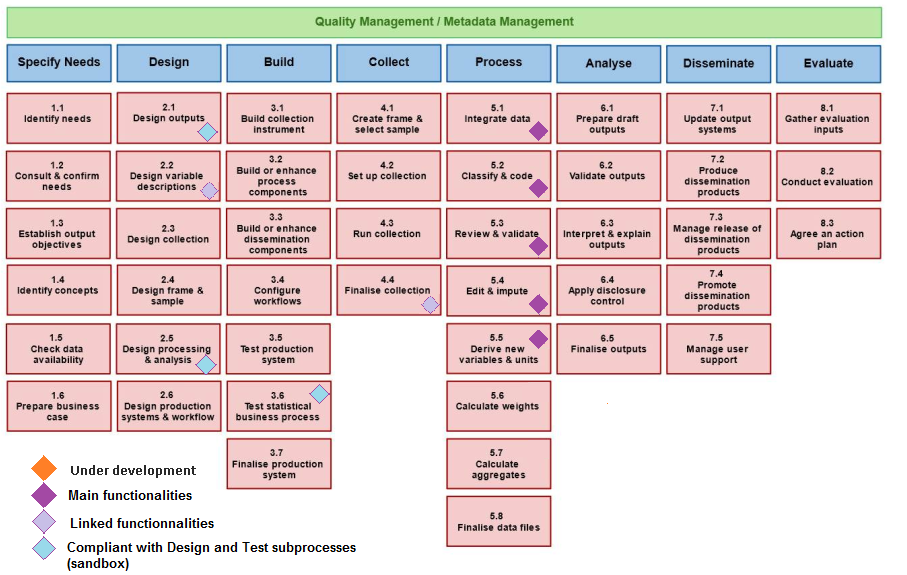

# ARC - Acquire - Register - Control 

## ARC user guides, tutorial and presentations
[User guide ARC old version](https://github.com/InseeFr/ARC/raw/master/user-guide/User_guide_v1.pdf)

[User guide ARC new version but unfinished yet](https://github.com/InseeFr/ARC/raw/master/user-guide/User_guide_v2.pdf)

[Tutorial](https://hackmd.io/@4bIbwfJtQQmv5Ph8VVuYMw/H1a1NUPBp#/)

[ARC functionnalities and architecture](https://hackmd.io/@4bIbwfJtQQmv5Ph8VVuYMw/Skp3VIvHa)

[Functionnal diagram](https://github.com/InseeFr/ARC/raw/master/user-guide/diagrammes_fonctionnels.pdf)

[Arc parameters : properties and environment variables](https://github.com/InseeFr/ARC/raw/master/user-guide/arc_parameters.md)

## Workbench for acquisition and normalization of data sets
[](https://github.com/InseeFr/ARC/actions/workflows/build.yml)

[](https://sonarcloud.io/dashboard?id=fr.insee%3Aarc)

[](https://opensource.org/licenses/MIT)

- [General presentation of the application](#General-presentation-of-the-application)
  - [More ARC presentations and tutorial](#More-ARC-presentations-and-tutorial)
- [Running the application](#Running-the-application)
  - [Running the web application with Docker](#Running-the-web-application-with-Docker)
    - [Maven build configuration (optionnal)](#Maven-build-configuration-optionnal)
    - [Database configuration](#Database-configuration)
    - [Log configuration (optionnal)](#Log-configuration-optionnal)
    - [All build options](#All-build-options)
    - [To run the image](#To-run-the-image)
  - [Running the app with docker-compose](#Running-the-app-with-docker-compose)
  - [Running the app with tomcat](#Running-the-app-with-tomcat)
    - [Set the tomcat and the database connection](#Set-the-tomcat-and-the-database-connection)
    - [Deploy or update the application](#Deploy-or-update-the-application)
  - [Test the deployment](#Test-the-deployment)

## General presentation of the application

The ARC (from the French: Acquisition - Réception - Contrôles) software allows receiving (administrative) data supplied by the providers (several formats are supported, particularly XML), to control the compliance of the received files, and to transform administrative data to elementary statistical data. The software enables the statistician to define and apply controls and mappings, to test them in a sandbox environment (linked to the software), and to put them into production without frequently calling on a developer.

These functionnalities/services aim the statistician’s independence and ability to adapt to the data evolutions, thereby avoiding impacts on the statistical chain.


### gsbpm diagram



## Running the application

The ARC application is a java 11 application, working with a PostgreSQL > 9.6 database. To run the app you will need this PostgreSQL DB and configure the connection in the [arc.properties](arc-web/src/main/resources/fr/insee/config/arc.properties) file. Once this is done

### Running the web application with Docker

The easiest way to run the ARC application is with docker, without modifying the code, you can easily pass some configuration like :

- maven build configuration
- database configuration
- log configuration

#### Maven build configuration (optionnal)

Because you could want to build the app with some custom maven settings or behind a proxy, there is 3 way to build the web app.

- The easy peasy way. If you don't need proxy or custom settings just run
  
  ```shell
  docker build -f app.Dockerfile -t arc .
  ```

- Behind a proxy. To run the maven phase behind a proxy you have to specify it. We created two args to pass the proxy settings to maven. If your proxy environnement variables are set, run

  ```shell
  docker build -f app.Dockerfile \
    --build-arg HTTP_PROXY=${HTTP_PROXY}  \
    --build-arg HTTPS_PROXY=${HTTPS_PROXY} \
    -t arc \
    .
  ```

  otherwise replace ${HTTP_PROXY} and ${HTTPS_PROXY} by your proxies.

- with maven settings. Finaly if you what to fully configure maven, add a maven settings.xml file in the ARC directory and run :

  ```shell
    docker build -f app.Dockerfile \
    --build-arg MAVEN_SETTINGS=path/to/maven/settings.xml  \
    -t arc \
    .
  ```

#### Database configuration

To configure the web application to use your database just pass the url, user and password in the docker build phases like this :

  ```shell
  docker build -f app.Dockerfile \
    --build-arg DATABASE_URL=jdbc:postgresql://your.db.url/schema \
    --build-arg DATABASE_USER=aValidUser \
    --build-arg DATABASE_PASSWORD=aValidPassword \
    -t arc \
    .
  ```

#### Log configuration (optionnal)

If you want to configure the log without modifying the code of the application, pass the log level or a custom log4j2.xml file to the docker build phase like this:

  ```shell
  docker build -f app.Dockerfile \
    --build-arg LOG_LEVEL= #ERROR by default \
    --build-arg LOG_SETTINGS= #fr/insee/config/log4j2.xml by default \
    -t arc \
    .
  ```

#### All build options

  ```shell
  docker build -f app.Dockerfile \
    --build-arg HTTP_PROXY=  #optionnal \
    --build-arg HTTPS_PROXY= #optionnal \
    --build-arg MAVEN_SETTINGS= #optionnal \
    --build-arg DATABASE_URL= \
    --build-arg DATABASE_USER= \
    --build-arg DATABASE_PASSWORD= \
    --build-arg LOG_PATH= #optionnal \
    --build-arg LOG_LEVEL= #optionnal \
    --build-arg LOG_SETTINGS= #optionnal\
    -t arc \
    .
  ```

#### To run the image

After the image build,

  ```shell
    docker run -p 8080:8080 arc
  ```

### Running the app with docker-compose

If you want do not have a postgreSQL database ready and want to try the app on the fly use docker-compose. It will build the wep application, the database ans link them. So just run

```shell
docker-compose up
```

### Running the app with tomcat

The ARC web-user application component uses an apache/tomcat server with version 8.5 or 9

#### Set the tomcat and the database connection

Add to the tomcat service or tomcat runner the parameter -Dproperties.path= to set up the directory location of properties files

For example in catalina.bat, the JAVA_OPTS parameters may be changed as followed

```bash
set "JAVA_OPTS=%JAVA_OPTS% -Djava.protocol.handler.pkgs=org.apache.catalina.webresources -Dproperties.file=D:\apache-tomcat-8.5.38\webapps\"
```

#### Examples of properties settings

Check [Arc parameters : properties and environment variables](https://github.com/InseeFr/ARC/raw/master/user-guide/arc_parameters.md) for full documentation on ARC properties and environment variables.

##### Set the root directory for the application
```properties
fr.insee.arc.batch.parametre.repertoire=C:\\Temp\\
```

##### Set arc connection to a single nod postgres database
```properties
## Database configuration
fr.insee.database.arc.url=jdbc:postgresql://localhost:5432/arc_single_nod
fr.insee.database.arc.username=user
fr.insee.database.arc.password=password
fr.insee.database.arc.driverClassName=org.postgresql.Driver
```

##### Set arc connection to multi nods postgres database
```properties
# Batch directory
fr.insee.arc.batch.parametre.repertoire=${env.applicationDirectory}

## Database configuration
fr.insee.database.poolName=arc
fr.insee.database.arc.url={0=>"jdbc:postgresql://localhost:5432/arc_coordinator_nod"},{1=>"jdbc:postgresql://localhost:5432/arc_executor_nod1"}
fr.insee.database.arc.username={0=>"user_coordinator"},{1=>"user_executor_nod1"}
fr.insee.database.arc.password={0=>"password_coordinator"},{1=>"password_executor_nod1"}
fr.insee.database.arc.driverClassName={0=>"org.postgresql.Driver"},{1=>"org.postgresql.Driver"}
```

##### Set loggers

- **Send the logs to console by letting the directory blank**

```properties
# Path to log output file - leave blank to log to consoleAppender
fr.insee.arc.log.directory=
fr.insee.arc.log.level=INFO
```

- **TRACE level will shows queries, logs will be sent to provided directory in rolling appenders files**

```properties
# Path to log output file - leave blank to log to consoleAppender
fr.insee.arc.log.directory= C://arc//log
fr.insee.arc.log.level=TRACE
```

#### Deploy or update the web and ws applications on tomcat

1. Stop tomcat server
2. Delete the content of the temporary tomcat directories namely "temp" and "work" directories
3. Copy arc-web.war into the "webapps" tomcat directory
4. Copy the resources-prod.properties to the properties directory
5. Start tomcat server

### Test the deployments
Use the healthchek
http://localhost:8080/arc-web/healthcheck
http://localhost:8080/arc-ws/healthcheck

> Change the host ip adress and port number according to the tomcat server and tomcat ARC application context configuration.

#### Use the web application
The entry point of arc web gui is located at this URL.
http://localhost:8080/arc-web/


> For more information about the installation go check the [Install guide](user-guide/Install_guide.md)
